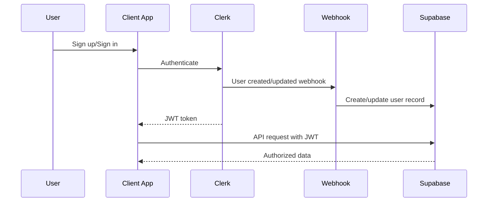

# TurboFit Authentication Development Guidelines

## Table of Contents
1. [Authentication Development Standards](#authentication-development-standards)
2. [Testing Requirements](#testing-requirements)
3. [Production Readiness Checklist](#production-readiness-checklist)
4. [Debugging and Troubleshooting Guide](#debugging-and-troubleshooting-guide)
5. [Onboarding Guide for New Developers](#onboarding-guide-for-new-developers)
6. [Emergency Response Procedures](#emergency-response-procedures)

---

## Authentication Development Standards

### Code Patterns and Conventions

#### 1. Authentication Component Structure

All authentication components must follow this pattern:

```typescript
// ✅ CORRECT: Authentication component with proper error handling
export function AuthComponent() {
  const [isLoading, setIsLoading] = useState(false);
  const [error, setError] = useState<string | null>(null);
  
  return (
    <div>
      {/* Required testID for automation */}
      <form data-testid="auth-form" onSubmit={handleSubmit}>
        <input
          data-testid="email-input"
          type="email"
          name="identifier"
          aria-label="Email address"
          aria-describedby={error ? "email-error" : undefined}
          required
        />
        <input
          data-testid="password-input"
          type="password"
          name="password"
          aria-label="Password"
          aria-describedby={error ? "password-error" : undefined}
          required
        />
        <button
          data-testid="submit-button"
          type="submit"
          disabled={isLoading}
          aria-label="Sign in to your account"
        >
          {isLoading ? 'Signing in...' : 'Sign In'}
        </button>
      </form>
      
      {/* Error display with proper ARIA */}
      {error && (
        <div 
          data-testid="error-message"
          role="alert"
          id="auth-error"
          aria-live="polite"
        >
          {error}
        </div>
      )}
      
      {/* Loading state indicator */}
      {isLoading && (
        <div data-testid="loading-indicator" aria-live="polite">
          Please wait...
        </div>
      )}
    </div>
  );
}
```

#### 2. Required Test Attributes

Every interactive authentication element MUST include:

```typescript
// Required attributes for all auth elements
const authElementAttributes = {
  // Primary test selector
  "data-testid": "unique-element-id",
  
  // Accessibility
  "aria-label": "Descriptive label",
  "aria-describedby": "error-id", // When errors present
  "role": "button|input|alert", // As appropriate
  
  // Form elements
  "name": "semantic-name",
  "type": "email|password|text",
  "required": true, // For required fields
};
```

#### 3. JWT Token Handling

**Secure Token Management:**

```typescript
// ✅ CORRECT: Secure token handling
const { getToken } = useAuth();

async function makeAuthenticatedRequest() {
  try {
    const token = await getToken({ template: 'supabase' });
    
    if (!token) {
      throw new Error('Authentication required');
    }
    
    const response = await fetch('/api/protected', {
      headers: {
        'Authorization': `Bearer ${token}`,
        'Content-Type': 'application/json',
      },
    });
    
    if (response.status === 401) {
      // Token expired, redirect to sign in
      throw new Error('Session expired');
    }
    
    return response.json();
  } catch (error) {
    handleAuthError(error);
  }
}

// ❌ WRONG: Insecure token handling
localStorage.setItem('jwt_token', token); // Never store JWTs in localStorage
```

#### 4. Error Handling Patterns

**Standardized Error Handling:**

```typescript
// Required error handling pattern
function handleAuthError(error: unknown) {
  const errorMap = {
    'Network error': 'Please check your internet connection and try again.',
    'Session expired': 'Your session has expired. Please sign in again.',
    'Invalid credentials': 'The email or password you entered is incorrect.',
    'Too many requests': 'Too many attempts. Please wait a moment and try again.',
    'Email not verified': 'Please check your email and verify your account.',
  };
  
  const userFriendlyMessage = errorMap[error.message] || 
    'An unexpected error occurred. Please try again.';
  
  setError(userFriendlyMessage);
  
  // Log detailed error for debugging (never expose to user)
  console.error('Auth error details:', error);
  
  // Report to monitoring system
  if (process.env.NODE_ENV === 'production') {
    reportError(error, { context: 'authentication' });
  }
}
```

#### 5. Performance Considerations

**Authentication Performance Standards:**

```typescript
// ✅ CORRECT: Optimized authentication flow
const AuthProvider = memo(({ children }) => {
  const [authState, setAuthState] = useState(null);
  
  // Debounce auth state changes
  const debouncedSetAuth = useMemo(
    () => debounce(setAuthState, 300),
    []
  );
  
  // Only update when necessary
  const authValue = useMemo(
    () => ({ ...authState }),
    [authState]
  );
  
  return (
    <AuthContext.Provider value={authValue}>
      {children}
    </AuthContext.Provider>
  );
});
```

---

## Testing Requirements

### When Developers MUST Write Tests

Authentication tests are **REQUIRED** before any code changes in these scenarios:

1. **Any authentication component modification**
2. **JWT token handling changes**
3. **Route protection updates**
4. **Webhook endpoint modifications**
5. **Database schema changes affecting auth**
6. **Error handling modifications**

### Test-Driven Development Process

```bash
# 1. Write failing test first
npm run test:auth -- --watch

# 2. Implement feature to make test pass
npm run test:auth:coverage

# 3. Refactor while keeping tests green
npm run test:auth:integration

# 4. Run full test suite
npm run test:all
```

### Using Shared Testing Utilities

```typescript
// ✅ CORRECT: Using testing utilities
import { 
  authTestHelper, 
  deviceAgnosticTestUtils,
  DeviceAgnosticPage,
  AuthPage 
} from '@repo/testing-utils';

describe('New Auth Feature', () => {
  let testUsers: any[] = [];
  
  beforeEach(async () => {
    // Use helper for consistent setup
    const userData = deviceAgnosticTestUtils.generateTestUserData();
    const user = await authTestHelper.createTestUser(userData);
    testUsers.push(user);
  });
  
  afterEach(async () => {
    // Always clean up
    await authTestHelper.cleanupTestUsers(testUsers);
    testUsers = [];
  });
  
  test('should handle new feature across devices', async ({ page }) => {
    const authPage = new AuthPage(page);
    const devicePage = new DeviceAgnosticPage(page);
    
    // Test on multiple viewports
    for (const viewport of ['mobile', 'tablet', 'desktop']) {
      await devicePage.setViewportSize(viewport);
      
      // Your test logic here
      await authPage.signIn(testUser.email, testUser.password);
      await expect(page).toHaveURL(/dashboard/);
    }
  });
});
```

### Required Test Coverage

**Minimum Coverage Thresholds:**

- **Authentication flows**: 100%
- **Error handling**: 95%
- **JWT token validation**: 100%
- **RLS policies**: 100%
- **Webhook processing**: 95%

**Coverage Verification:**

```bash
# Check coverage before committing
npm run test:auth:coverage

# Must meet thresholds:
# Statements: 95%
# Branches: 90%
# Functions: 95%
# Lines: 95%
```

### Adding New Test Scenarios

```typescript
// Add new scenarios to the testing utilities
export const newAuthScenario = {
  // Scenario definition
  email: 'test@example.com',
  password: 'NewFeaturePassword123!',
  shouldSucceed: true,
  expectedBehavior: 'custom-behavior',
  
  // Device-specific variations
  mobileOverride: {
    timeout: 5000,
  },
  
  // Accessibility requirements
  a11yChecks: true,
};
```

---

## Production Readiness Checklist

### Pre-Deployment Verification

**Environment Configuration:**

```bash
# ✅ Verify all required environment variables
./scripts/verify-auth-config.sh

# Required variables checklist:
export NEXT_PUBLIC_CLERK_PUBLISHABLE_KEY="pk_test_..."
export CLERK_SECRET_KEY="sk_test_..."
export CLERK_WEBHOOK_SECRET="whsec_..."
export NEXT_PUBLIC_SUPABASE_URL="https://..."
export SUPABASE_SERVICE_ROLE_KEY="service_role_key..."

# Mobile app (.env in apps/native/)
export EXPO_PUBLIC_CLERK_PUBLISHABLE_KEY="pk_test_..."
export EXPO_PUBLIC_SUPABASE_URL="https://..."
export EXPO_PUBLIC_SUPABASE_KEY="anon_key..."
```

**Security Audit Requirements:**

```bash
# 1. JWT Template Verification
curl -X GET "https://api.clerk.com/v1/jwt_templates" \
  -H "Authorization: Bearer ${CLERK_SECRET_KEY}"

# Verify 'supabase' template exists with correct claims:
# - aud: "authenticated"
# - exp: {{ user.session.expire_at }}
# - iat: {{ user.session.issued_at }}  
# - iss: "https://your-app.clerk.accounts.dev"
# - nbf: {{ user.session.issued_at }}
# - sub: {{ user.id }}

# 2. RLS Policy Testing
npm run test:rls:all

# 3. Webhook Security Check
./scripts/test-webhook-security.sh
```

**Performance Benchmarks:**

```bash
# Authentication must meet these thresholds:
# - Sign in time: < 2s (desktop), < 4s (mobile)
# - Token refresh: < 500ms
# - Page load after auth: < 3s
# - Webhook processing: < 1s

npm run test:performance:auth
```

### Database Migration Checklist

```sql
-- 1. Verify RLS policies are active
SELECT schemaname, tablename, rowsecurity 
FROM pg_tables 
WHERE schemaname = 'public' AND rowsecurity = false;
-- Should return no rows

-- 2. Test RLS policies work correctly
SET ROLE authenticated;
SELECT * FROM users; -- Should only return current user's data

-- 3. Verify indexes exist for performance
\d users
\d activities
\d user_metrics
```

### Monitoring and Alerting Setup

```typescript
// Required monitoring points
const authMonitoring = {
  // Success/failure rates
  signInSuccessRate: {
    threshold: 95, // %
    alertChannel: '#auth-alerts',
  },
  
  // Performance metrics
  authenticationLatency: {
    p95: 2000, // ms
    p99: 5000, // ms
  },
  
  // Error rates
  tokenRefreshFailures: {
    threshold: 1, // %
    escalation: 'immediate',
  },
  
  // Webhook processing
  webhookProcessingTime: {
    threshold: 1000, // ms
    retryLimit: 3,
  },
};
```

---

## Debugging and Troubleshooting Guide

### Common Authentication Issues

#### 1. PGRST301 Errors (JWT/RLS Issues)

**Symptoms:**
```
PGRST301: JWT claims do not match expected audience
```

**Diagnosis:**
```bash
# 1. Verify JWT template configuration
echo "JWT_TOKEN_HERE" | base64 -d | jq .

# 2. Check RLS policies
psql -c "SELECT * FROM pg_policies WHERE tablename = 'users';"

# 3. Test token generation
node -e "
const jwt = require('jsonwebtoken');
const token = 'YOUR_TOKEN_HERE';
console.log(jwt.decode(token, {complete: true}));
"
```

**Solutions:**
```typescript
// Fix JWT template in Clerk dashboard
{
  "aud": "authenticated",
  "exp": "{{ user.session.expire_at }}",
  "iat": "{{ user.session.issued_at }}",
  "iss": "https://your-app.clerk.accounts.dev",
  "nbf": "{{ user.session.issued_at }}",
  "sub": "{{ user.id }}"
}

// Update RLS policy if needed
CREATE POLICY "Users can view own data" ON users
  FOR SELECT USING (clerk_user_id = auth.jwt() ->> 'sub');
```

#### 2. Webhook Processing Failures

**Symptoms:**
- Users created in Clerk but not in Supabase
- Webhook timeouts
- Svix verification errors

**Diagnosis:**
```bash
# Check webhook logs
grep "webhook" /var/log/app.log

# Test webhook endpoint manually
curl -X POST http://localhost:3000/api/webhooks/clerk \
  -H "Content-Type: application/json" \
  -H "svix-id: test-id" \
  -H "svix-timestamp: $(date +%s)" \
  -H "svix-signature: test-sig" \
  -d '{"type":"user.created","data":{"id":"test"}}'
```

**Solutions:**
```typescript
// Add retry logic to webhook handler
async function handleClerkWebhook(evt: ClerkWebhookEvent) {
  const maxRetries = 3;
  let lastError: Error;
  
  for (let attempt = 1; attempt <= maxRetries; attempt++) {
    try {
      await processWebhookEvent(evt);
      return;
    } catch (error) {
      lastError = error;
      
      if (attempt < maxRetries) {
        await new Promise(resolve => 
          setTimeout(resolve, 1000 * Math.pow(2, attempt))
        );
      }
    }
  }
  
  // Log failure for manual investigation
  console.error('Webhook processing failed after retries:', lastError);
  throw lastError;
}
```

#### 3. Test Failures and Analysis

**Common Test Failure Patterns:**

```typescript
// Flaky test due to timing issues
// ❌ PROBLEMATIC
test('should authenticate user', async () => {
  await signIn();
  expect(page.url()).toContain('/dashboard'); // May fail due to redirect timing
});

// ✅ FIXED
test('should authenticate user', async () => {
  await signIn();
  await expect(page).toHaveURL(/dashboard/, { timeout: 10000 });
});
```

**Test Debugging Commands:**

```bash
# Run specific failing test with debug output
npm run test:auth -- --testNamePattern="specific test" --verbose

# Run with video recording for visual debugging  
npm run test:e2e -- --headed --slowMo=1000

# Generate test report with artifacts
npm run test:auth:report
```

---

## Onboarding Guide for New Developers

### Development Environment Setup

#### 1. Prerequisites Installation

```bash
# Install required tools
curl -fsSL https://bun.sh/install | bash
bun install

# Install development dependencies
brew install postgresql # For local database testing
npm install -g @playwright/test
```

#### 2. Environment Configuration

```bash
# 1. Copy environment templates
cp apps/web/.env.local.example apps/web/.env.local  
cp apps/native/.env.example apps/native/.env

# 2. Get credentials from team lead:
# - Clerk publishable/secret keys
# - Supabase URL/keys  
# - Webhook secrets

# 3. Verify setup
bun run verify:env
```

#### 3. Running Authentication Tests

```bash
# Start development servers
bun dev

# In separate terminal, run auth test suite
cd apps/web && npm run test:auth:local

# For mobile testing
cd apps/native && npm run test:maestro:auth
```

### Understanding the Auth Architecture

#### Authentication Flow Diagram



#### Data Flow Understanding

```typescript
// Key concepts every developer must understand:

// 1. Clerk handles authentication UI and user management
const { user, isSignedIn } = useUser();

// 2. JWT tokens authorize Supabase requests
const { getToken } = useAuth();
const token = await getToken({ template: 'supabase' });

// 3. RLS policies secure database access
// Policy uses JWT 'sub' claim to match 'clerk_user_id'
CREATE POLICY "policy_name" ON table_name
  FOR SELECT USING (clerk_user_id = auth.jwt() ->> 'sub');

// 4. Webhooks sync user data between Clerk and Supabase
// Webhook endpoint: /api/webhooks/clerk/route.ts
```

### Contributing Authentication Features

#### 1. Feature Development Process

```bash
# 1. Create feature branch
git checkout -b feature/auth-enhancement

# 2. Write tests first (TDD)
# Add test cases to apps/web/tests/integration/
# Add E2E tests to apps/web/tests/e2e/

# 3. Implement feature
# Follow established patterns in existing components

# 4. Run comprehensive test suite
npm run test:auth:full

# 5. Submit PR with test coverage report
```

#### 2. Code Review Checklist

Before submitting PR, verify:

- [ ] All interactive elements have `data-testid` attributes
- [ ] ARIA labels and roles are properly set
- [ ] Error states are handled and tested
- [ ] Loading states are implemented
- [ ] JWT tokens are handled securely
- [ ] Cross-device compatibility is verified
- [ ] Performance meets benchmarks
- [ ] Tests achieve required coverage

---

## Emergency Response Procedures

### Authentication Outage Response

#### Severity Levels

**Critical (P0) - Complete Authentication Failure**
- No users can sign in
- Token generation failing
- Database authentication broken

**High (P1) - Partial Authentication Issues**  
- Some users cannot sign in
- Intermittent token failures
- Webhook processing delays

**Medium (P2) - Performance Degradation**
- Slow authentication
- High error rates but functioning
- Non-critical feature failures

#### Immediate Response Actions

```bash
# 1. Assess Impact (< 2 minutes)
./scripts/check-auth-health.sh

# 2. Check Service Status
curl -f https://api.clerk.com/health
curl -f https://your-supabase.supabase.co/health

# 3. Review Recent Deployments
git log --oneline -10 --grep="auth"

# 4. Check Error Rates
grep "auth.*error" /var/log/app.log | tail -50
```

#### Rollback Procedures

```bash
# 1. Immediate Rollback (Critical Issues)
# Web app rollback
vercel rollback --url turbofit.dev

# Mobile app rollback (if recent release)
# Use Expo Updates for immediate rollback
npx expo publish --rollback

# 2. Database Rollback (If Schema Changes)
# Identify migration to rollback to
psql -c "SELECT * FROM supabase_migrations.schema_migrations ORDER BY version DESC LIMIT 5;"

# Rollback migration (CAUTION)
supabase db reset --db-url $DATABASE_URL --to=TIMESTAMP

# 3. Configuration Rollback
# Revert Clerk JWT template changes in dashboard
# Restore previous webhook URLs
```

#### User Data Protection

During incidents:

```typescript
// 1. Enable maintenance mode with user data protection
const maintenanceMode = {
  enabled: true,
  allowSignOut: true,  // Always allow users to sign out
  preserveSessions: true,  // Don't invalidate existing sessions
  message: 'We are experiencing technical difficulties. Existing sessions remain active.',
};

// 2. Monitor for data exposure
const securityCheck = {
  verifyRLSActive: true,
  checkUnauthorizedAccess: true,
  validateTokenIntegrity: true,
};

// 3. Communication protocol
const communicationPlan = {
  statusPage: 'Update status.turbofit.dev immediately',
  userNotification: 'In-app banner for signed-in users',
  teamNotification: '#incidents Slack channel',
  customerService: 'Prepare FAQ responses',
};
```

#### Recovery Verification

```bash
# Post-incident verification checklist
./scripts/verify-auth-recovery.sh

# 1. End-to-end authentication test
npm run test:auth:production

# 2. Performance verification
./scripts/check-auth-performance.sh

# 3. Data integrity check
psql -c "SELECT COUNT(*) FROM users WHERE created_at > NOW() - INTERVAL '1 hour';"

# 4. Webhook processing verification
curl -X POST /api/test/webhook-health
```

#### Post-Incident Analysis

Required within 24 hours:

1. **Incident Timeline**
   - When did the issue start?
   - What was the root cause?
   - How long until resolution?

2. **Impact Assessment**
   - Number of affected users
   - Data exposure risk
   - Revenue impact

3. **Prevention Measures**
   - Additional monitoring needed
   - Code changes required
   - Process improvements

4. **Communication Review**
   - Response time analysis
   - User communication effectiveness
   - Team coordination assessment

### Contact Information

**Emergency Contacts:**

- **On-call Engineer**: [Slack: @oncall-auth]
- **Database Admin**: [Slack: @dba-team]  
- **Security Team**: [Slack: @security]
- **Product Manager**: [Slack: @pm-auth]

**External Services:**

- **Clerk Support**: [Email: support@clerk.com]
- **Supabase Support**: [Email: support@supabase.com]
- **Vercel Support**: [Email: support@vercel.com]

---

## Conclusion

This document serves as the authoritative guide for authentication development at TurboFit. All developers working on authentication features must familiarize themselves with these guidelines and follow them strictly.

Regular updates to this document should be made as the authentication system evolves. Any questions or clarifications should be directed to the authentication team leads.

**Remember: Authentication is the foundation of user trust. Handle it with the utmost care and attention to security, reliability, and user experience.**